<p align="center">
  
</p>

# TermWorm

**A one-click, embedded Linux terminal for Klipper and Mainsail.**

TermWorm bridges the gap between your 3D printer's web interface and the host operating system. With a single command, it installs a web-based terminal emulator (`ttyd`) and automatically injects a native shortcut button right into your Mainsail sidebar. 

## Security Warning
**Please read before installing.**

TermWorm creates a web-accessible terminal that drops directly into the bash shell of your host machine **without requiring a password**. 
* This tool is designed strictly for **trusted, local networks (LAN) only**.
* **DO NOT** expose your printer or port `7681` to the internet via router port-forwarding, tunneling services (like ngrok or Cloudflare), or public IPs.
* Anyone who can access your Mainsail web interface on your network will have full command-line access to your printer's host OS. 

## Features
* **Zero Configuration:** Automatically detects your host IP and binds the correct ports.
* **Native Mainsail Integration:** Injects a clean, native UI icon into the Mainsail sidebar.
* **Persistent:** Runs as a lightweight systemd background service that survives reboots.
* **Full Root Access:** Run `htop`, `nano`, `kiauh`, or manage updates directly from your browser.

## One-Line Installation

SSH into your Klipper host (Raspberry Pi, Mini PC, etc.) and run the following command:

```bash
curl -sSL https://raw.githubusercontent.com/Kanrog/TermWorm/main/install.sh | bash
```

Once the script finishes, simply **refresh your Mainsail browser tab**. You will see a new "Linux Terminal" icon in the left-hand sidebar. 

## How it Works
1. Installs `ttyd` via the standard `apt` package manager.
2. Creates a `systemd` service (`ttyd.service`) to keep the web terminal running on port `7681`.
3. Writes a `navi.json` file to your `~/printer_data/config/.theme/` directory to generate the Mainsail UI button.

## Uninstallation
If you ever want to remove TermWorm, run these commands to stop the service and remove the UI button:
```bash
curl -sSL https://raw.githubusercontent.com/Kanrog/TermWorm/main/uninstall.sh | bash
```
*(Note: You may also want to `sudo apt remove ttyd` if you no longer need the package).*
